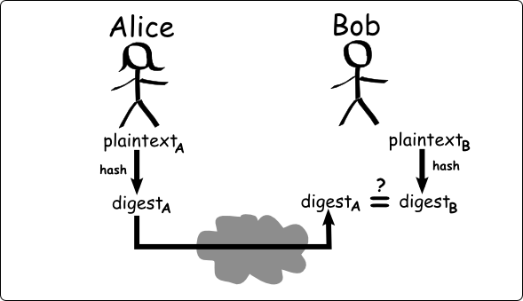

# Hasher



## Table of contents

- [\Pluggit\Hasher\Hasher](#class-pluggithasherhasher)

<hr />

### Class: \Pluggit\Hasher\Hasher

> The Hasher class is in charge of create and validate hashes given a payload

| Visibility | Function |
|:-----------|:---------|
| public | <strong>__construct(</strong><em>string</em> <strong>$privateKey</strong>)</strong> : <em>void</em><br /><em>Hasher constructor, both parts of the communication, have to use the same private key.</em> |
| public | <strong>hash(</strong><em>string</em> <strong>$payload</strong>)</strong> : <em>string</em><br /><em>Create a hash given a payload</em> |
| public | <strong>isValid(</strong><em>string</em> <strong>$payload</strong>, <em>string</em> <strong>$hash</strong>)</strong> : <em>bool</em><br /><em>Validate a hash given a payload</em> |

### Command-line hash generation

To generate a new hash execute:
```php
./hasher hash <private_key> <payload>
```

To check if a hash is valid execute:
```
./hasher check <private_key> <payload> <hash>
```